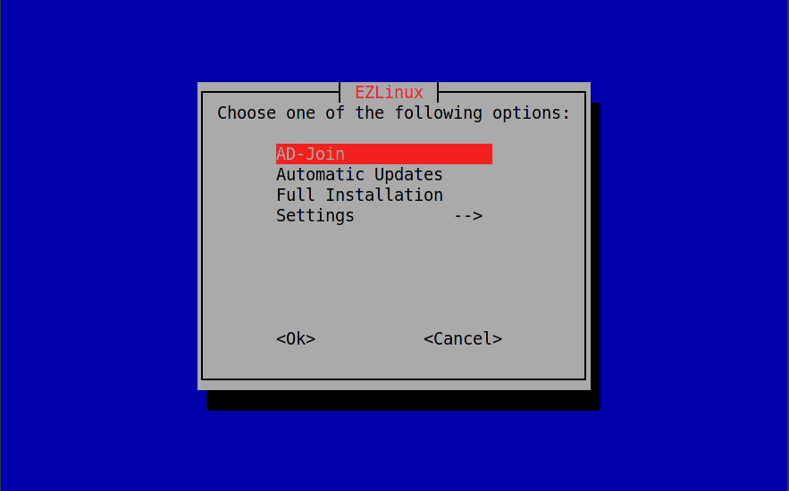

# EzLinux
Very basic ADJoin/AutoUpdate install.

<p align="center"></a></p>

<br />

# Install

`wget https://git.io/JDuBu -O EzLinux && chmod +x EzLinux && sudo ./EzLinux`

# Usage
```
Arrow keys to navigate
```
