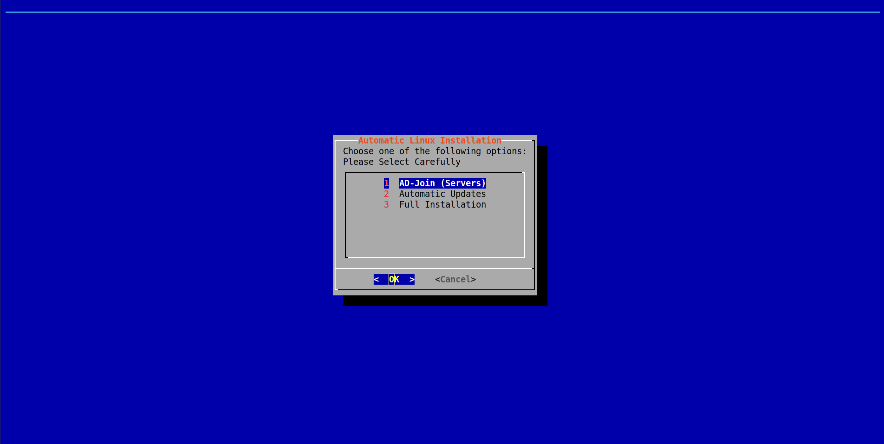

# Linux Server Setup
Very basic ADJoin/AutoUpdate install.

<p align="center"></a></p>

<br />

# Install
```
curl -L "https://raw.githubusercontent.com/gorgdel/Linux-AD-AutoUpdate-Setup/master/Public%20Release" -o auto-setup.script
```
# Usage
```
bash auto-setup.script
```
